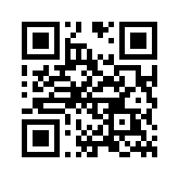

# Matter Illuminance Measurement Sensor Example (ESP32 + VEML7700)
Matter 밝기 측정 센서 (조도 센서) 예제 프로젝트<br>
다음 Matter 클러스터에 대한 코드 구현 방법을 알아본다
- Illuminance Measurement (Cluster ID: `0x0400`)

Software (Matter)
---
1개의 Endpoint가 아래와 같이 생성된다.
1. Endpoint ID `1`<br>
    Device Type: Light Sensor (Classification: `0x0106`)<br>
    [Clusters]
    - Illuminance Measurement (Cluster ID: `0x0400`)<br>
        [Attributes]
        - Measured Value (Attribute ID: `0x0000`)
        - Min Measured Value (Attribute ID: `0x0001`)
        - Max Measured Value (Attribute ID: `0x0002`)

Hardware
---
[VEML7700](https://www.vishay.com/docs/84286/veml7700.pdf): I2C 통신 방식의 디지털 주변광 센서(Ambient Light Sensor) <br>
<p style="text-align:center"></p><br>

I2C GPIO 핀번호 변경은 /main/include/definition.h에서 아래 항목을 수정<br>
default: `SDA` = GPIO`18` / `SCL` = GPIO`19`
```c
#define GPIO_PIN_I2C_SCL 19
#define GPIO_PIN_I2C_SDA 18
```

SDK Version
---
- esp-idf: [v5.1.2](https://github.com/espressif/esp-idf/tree/v5.1.2)
- esp-matter: [fe4f9f69634b060744f06560b7afdaf25d96ba37](https://github.com/espressif/esp-matter/commit/fe4f9f69634b060744f06560b7afdaf25d96ba37)
- connectedhomeip: [d38a6496c3abeb3daf6429b1f11172cfa0112a1a](https://github.com/project-chip/connectedhomeip/tree/d38a6496c3abeb3daf6429b1f11172cfa0112a1a)
  - Matter 1.1 released (2023.05.18)
  - Matter 1.2 released (2023.10.23)

Helper Scripts
---
SDK 클론 및 설치
```shell
$ source ./scripts/install_sdk.sh
```
SDK (idf.py) 준비
```shell
$ source ./scripts/prepare_sdk.sh
```

Build & Flash Firmware
---
1. Factory Partition (Matter DAC)
    ```shell
    $ source ./scripts/flash_factory_dac_provider.sh
    ```
2. Configure project
    ```shell
    $ idf.py set-target esp32
    ```
3. Build Firmware
    ```shell
    $ idf.py build
    ```
4. Flash Firmware
    ```shell
    $ idf.py -p ${seiral_port} flash monitor
    ```

QR Code for commisioning
---


References
---
[Matter 밝기 측정 클러스터 개발 예제 (ESP32)](https://yogyui.tistory.com/entry/PROJ-Matter-%EB%B0%9D%EA%B8%B0-%EC%B8%A1%EC%A0%95-%ED%81%B4%EB%9F%AC%EC%8A%A4%ED%84%B0-%EA%B0%9C%EB%B0%9C-%EC%98%88%EC%A0%9C-ESP32)<br>
